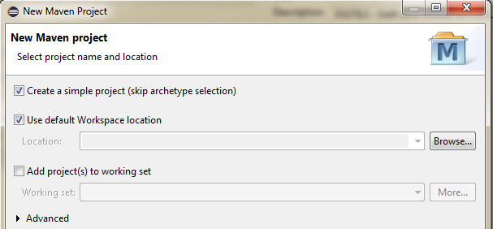
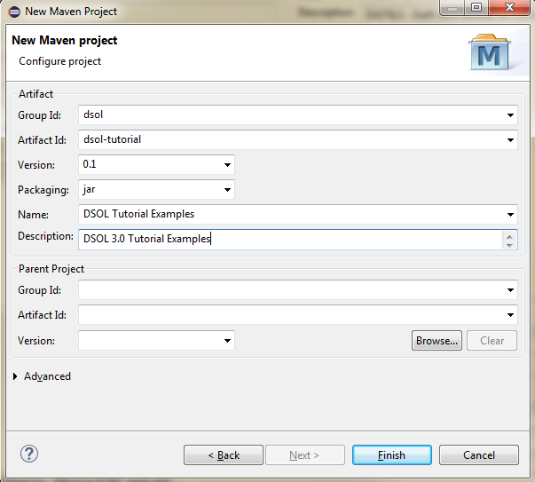
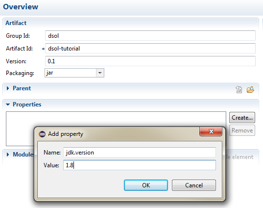
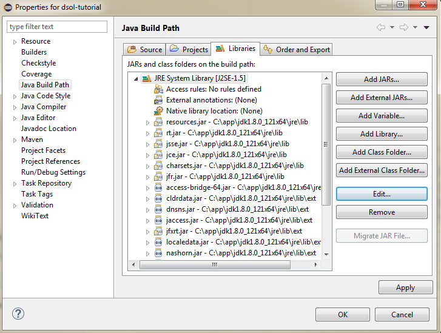
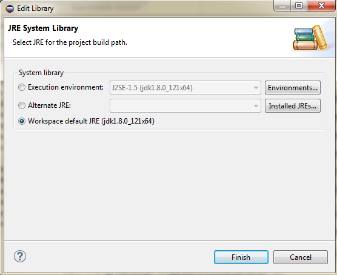
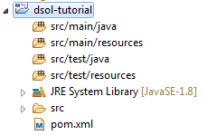

# Installing Eclipse (with built-in Java and Maven)

Eclipse is an open-source development environment for, amongst others, Java projects. The Eclipse development environment is available for Windows, Mac, and Linux.

The supplychain simulation library is dependent on several external libraries to function properly. The easiest way to run a supplychain-dependent model is to have Apache Maven figure out what libraries are needed to run the supplychain model. [Apache Maven](https://maven.apache.org/) is a flexible and open source build tool that, amongst a large set of functions, enables programmers to automatically resolve dependencies and easily build their project. The Eclipse Java installations all contain Maven, making it really easy to set-up, develop, and run a simulation based on the supplychain library. 

In order to start using the suppplychain simulation library, download and install one of the Eclipse development tools via the Eclipse installer: [https://www.eclipse.org/downloads/packages/installer](https://www.eclipse.org/downloads/packages/installer) or more fine-grained from [https://www.eclipse.org/downloads/packages/](https://www.eclipse.org/downloads/packages/). Make sure to take a version for Java development that contains Maven for Eclipse (m2e); the "Eclipse IDE for Java Developers" is probably your best choice. If you want to choose an installation folder in Windows, you might put it in a folder for 'offline installations', such as `c:\app\eclipse` on Windows. Eclipse, as an offline installation, does not install as a regular program, is fully self-contained, and does not rely on the Windows registry. Create a start menu entry or a desktop shortcut for Eclipse to easily start it.

By default, Eclipse starts with a built-in Java version. If you go to the folder where Eclipse has been installed, you see an 'eclipse.ini' file. In this file, there is an indication of the Java version (the 'vm' or Virtual Machine') that is used:

```
-vm
plugins/org.eclipse.justj.openjdk.hotspot.jre.full.win32.x86_64_15.0.2.v20210201-0955/jre/bin
```
So, in this case the Java version that is used is Java version 15, built into Eclipse. This is sufficient to run. You can also install a stable, Long-Term Support (LTS) version of Java yourself -- see the following section what to do in case you want to install a version of Java yourself. If you have installed your own Java version, e.g. in C:\app\jdk11 for Windows, change the above 'vm' setting to:

```
-vm
C:/app/jdk11/bin
```

Of course it is possible to use another development environment such as Netbeans ([https://netbeans.org/downloads/](https://netbeans.org/downloads/)) instead of Eclipse, and a build manager such as Gradle ([https://gradle.org/](https://gradle.org/)) instead of Maven. This manual, however, uses Eclipse and Maven as reference examples.


## Installing Java (optional -- you can use the Eclipse version)

For **Windows**, install OpenJDK version 11 (the current LTS = Long Term Support version). Download the zip for Java 11 at [https://jdk.java.net/archive/](https://jdk.java.net/archive/) for your operating system. You can install a later version of Java, but the current version of the supplychain simulation library has been developed and tested with Java version 11. The best way to install Java is to unpack the Java zip in a folder without spaces in the folder name, e.g., C:\app\jdk11. Make sure to add Java to the current 'Path' (on Windows-10 go to Windows Settings - System - About and click 'Advanced Systems Settings' on the right. Click 'Environment Variables' in the 'Systems Properties' screen. Edit the 'Path' entry and add `C:\app\jdk11\bin` as an entry (adapt for your chosen location). You can move the entry to before 'C:\Windows\system32' to override a Java client in Windows. Add or modify an entry `JAVA_HOME` and set the value to `C:\app\jdk11` (adapt for your chosen location). You can test whether Java works by opening a Command prompt (CMD) and typing `java -version`. If Java responds with with version 11, the installation has succeeded.

For **MacOS**, install OpenJDK version 11, e.g., using the following instruction: [https://techoral.com/blog/java/install-openjdk-11-on-mac.html](https://techoral.com/blog/java/install-openjdk-11-on-mac.html).

For **Debian / Ubuntu** versions of Linux, use the command `sudo apt install openjdk-11-jdk` to install OpenJDK version 11. For

**CentOS / RedHat** versions of Linux, use the command `sudo yum install java-11-openjdk-devel` or `sudo dnf install java-11-openjdk-devel` to install OpenJDK version 11. If you want to know which java installations are available on CentOS / RedHat, type: `yum search jdk` or `dnf search jdk`, and choose the one you want to install.


## Creating a new project in Eclipse

After installation of Java and Eclipse, everything should be ready to go. Start Eclipse, and create a new Workspace, which you can use to create many different projects and models within those projects. Eclipse works as follows:
* Eclipse can handle multiple **workspaces**. A workspace is a logical collection of projects that belong together. Possibly, these projects use common resources or settings. Often, simulation users have only one workspace, sometimes with several projects. Workspace names can be lowercase only, or a combination of lowercase and upper case. Do not use spaces in the name.
* A workspace consists of multiple **projects**. A project is a total set of Java classes that belong together. Projects can be 'packaged' into an executable Jar file (a jar file is a zip file with Java contents; jar stands for Java ARchive). Usually, an Eclipse project is related to a "real" project for which simulation code is being developed. Project names can be lowercase only, or a combination of lowercase and upper case. Spaces are not allowed.
* A project contains **packages**. Each package has a logical name, using a reverse URL-structure. Most of the supplychain package names start with "nl.tudelft.simulation.actor" or "nl.tudelft.simulation.supplychain". As a good habit, don't use the so-called 'default package', which is a package without a name. Packages contain Java classes that belong together. Typically, package names are lowercase only. Spaces are not allowed in the name.
* A package contains **Java classes**. Each Java class is contained in its own file, with ".java" as the extension. The class name is the same (including case) as the filename without extension. Typically, CamelCase is used for the class names. An example of a class name is `TutorialExample12` which would be contained in a file with the name `TutorialExample12.java`. Class names cannot have spaces.

In order to get started, create a new **Maven project**, not a 'normal' Java project. Maven projects can be created by using 'File' - 'New' - 'Other' - 'Maven' - 'Maven Project'. Type 'Next&gt;'. Select: 'Create a simple project':



A Maven project name consists of three classifiers:
* a **group id**, which is an identifier of a group of projects that belong together, e.g. within an organization (the group id could be `nl.tudelft` or `nl.tudelft.tbm.ba` or `nl.tudelft.simulation`), or within a logical group of projects (the group id could be `sc-example` `global-simulation`). Choose a logical name that 'binds' the group of projects within the workspace you are using.
* a **artifact id**, which is an identifier of the current project, e.g., `supplychain-tutorial`.
* a **version number**, usually dot-coded numericals, e.g., major.minor (`0.1` or `12.08`) or major-minor-update (`3.1.1`; this is the coding that the supplychain simulation library uses). 

In addition, give a clear name and description to the project:



After pressing "Finish", the project and its default structure will be created. The default project structure contains four major folders:


* **src/main/java** where the packages and classes within the packages are placed;
* **src/main/resources** where the other files (XML, properties, pictures, etc.) that are not Java code are placed;
* **src/test/java** where the test code (if any) is placed; test code such as unit tests take care of guarding the integrity of the code in src/main/java;
* **src/test/resources** where the resources for the test code are placed; test code and resources are not copied into executable jar files.

In this case, the JRE System Library indicates that version 5 of Java is used for compilation (the J2SE-1.5 in green in the above picture). This is the wrong version of Java, as DSOL is dependent on Java version 11 or higher. Therefore, we have to tell Eclipse (or Maven) that we want to use compliance with Java version 11. This can be done in two ways.


### Including the Java version in the POM-file

The first (and preferred) way how to do this is to double click on the `pom.xml` file in the Package Explorer in Eclipse. The Overview screen of the pom-file opens. Open 'properties' and click 'Create...'. Add a property with the name `jdk.version` and value: `11`:



Similarly, add a property `maven.compiler.source` with value `11`, and a property `maven.compiler.target` with value `11`. The properties should now look as follows:


Save the pom-file (by pressing Ctrl/S, or by selecting the 'Save' icon in the top toolbar, or by selecting the 'File' menu and using 'Save'). Then right-click on the project name (in this case: `supplychain-tutorial`), select 'Maven', Update Project, and click 'Ok'. The version should be updated to JavaSE-11.

Instead of editing the properties in the Overview screen, they can be typed directly into the pom.xml. Select the 'pom.xml' tab from the right bottom tabs, and under the exisiting information about the project (here copied for reference), the properties (the 5 lines before `</project>`) can be added:

```xml
<project xmlns="http://maven.apache.org/POM/4.0.0" xmlns:xsi="http://www.w3.org/2001/XMLSchema-instance"
  xsi:schemaLocation="http://maven.apache.org/POM/4.0.0 http://maven.apache.org/xsd/maven-4.0.0.xsd">
  <modelVersion>4.0.0</modelVersion>
  
  <groupId>dsol</groupId>
  <artifactId>supplychain-tutorial</artifactId>
  <version>0.1</version>
  <name>SUPPLYCHAIN Tutorial Examples</name>
  <description>SUPPLYCHAIN Tutorial Examples</description>
  
  <properties>
    <jdk.version>11</jdk.version>
    <maven.compiler.source>11</maven.compiler.source>
    <maven.compiler.target>11</maven.compiler.target>
  </properties>
</project>
```

Save the pom.xml file. Right-click on the project name in the Package Explorer at the left of the screen, select 'Maven', Update Project, and click 'Ok'. The version should be updated to JavaSE-11.


### Change the Java build path in Eclipse

The second way how to change this is to right-click the JRE System Library entry in the Eclipse Package Explorer. Select 'Build Path - Configure Build Path'. Click on the JRE System Library in the tab 'Libraries':



Click 'Edit', and select the Workspace default JRE:



Click 'Finish' to save the changes. Note that when Maven does an update, it is possible that the default Java version is changed back to version 1.5 instead of 11 (or higher). Therefore, the first method where the changes were made in the pom.xml file, is preferred.


#### Result: Java 11 used

In either case, the JRE System Library should now be correct:



